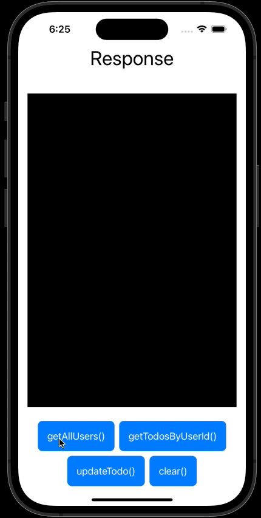

# FakeAPI (Swift)

This repository contains resources for the FakeAPI (Swift) project.

# Overview

FakeAPI is a project that use **URLSession** to create a GraphQL Network layer. Furthermore, it can be tested with Fake GraphQL APIs if the url provided. This specific implementation is written exclusively in **Swift**.

# Demo

